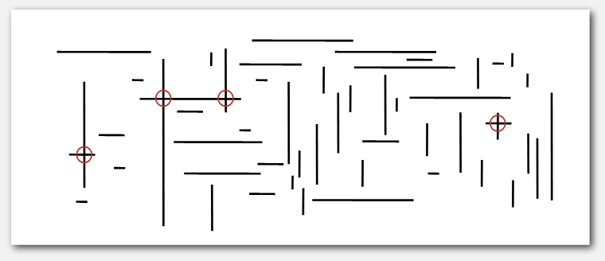

## 1D range search

Extension of order symbol table (structure: binary heap).

Must be able to:
- Insert, search for key, delete key
- Range search (find all keys between k1, k2)
- Range count (number of keys between k1, k2)

Geometrically: how many points along a line between two points?

|                 | insert | range search | range count |
|-----------------|--------|--------------|-------------|
| unordered array | 1      | N            | N           |
| ordered array   | N      | log N        | log N + R   |
| BST             | log N  | log N        | log N + R   |

*note: N is the number of keys, R is the number of matches.*

ordered array: have to insertion shift, so insert time not ideal.
but can easily find range in 2 binary searches, one for left end pt and one for
right.

Range search strategy ft. BST:
1. recursively check if left subtree has anything in the range.
    - if itself is out of range, don't include it in the range but do use it for
      checking if it's children are within the range.
2. check current node's key
3. recursively check if right subtree has anything in the range.

### Find the intersections of horizontal/vertical line segments

Naive method: quadratic. Check if every two lines intersection.



#### Sweep line algorithm
Sweep a vertical line from the left to the right. 

- horiz starts = ``` insert(x,y) ```
- horiz ends = ``` remove(x) ``` 
- hit a vertical = do a range search!

``` insert ``` and ``` remove ``` take approx log(n) time each.
if we have n horiz and m verticals, then approx total time is 
    m log n + 2m * log m + R. so if n = m = sqrt(N), then time is
    sqrt(N)(log sqrt(N))(1 + 2 * sqrt(N)) + R ~ n log N + R.

> note 1: log sqrt(N) = (log N) - 1.
> note 2: remember to put all of the horizontal lines on a priority queue first.
> note 3: worst time = average time

## 2D range search

Same as 1D, but must be able to do this for 2 keys.

Geometrically: how many points in a h-v rectangle.

Naive: h*v time for range search and count.

### Grid implementation

- divide space into m*m grid of squares.
- each square is indexed by a 2D array.
- search for points in squares that intersect 2d range query.
- **Space**: m^2 + n *[m^2 2d arrays, n points]*
- **Time**: 1 + n / m^2 * square checked (on average)
- optimal: m = sqrt(n). works if things are evenly distributed


Q: What is the problem with the grid method?

A: Often clustering occurs. No even distribution of points. We need to find a
data structure that adapts elegantly.

### Space-partitioning trees

A lot of graphical implementations are only made possible due space partitioning
trees. We'll look at the 2d tree.

- insert 1st point: divide into half horizontally
- insert 2nd and 3rd point: divide their subplane into half vertically
- recursively divide the subplanes.

how to insert?


#### Range search in 2d tree

again the idea is just to:

- check recursively if the left partition of the node intersects with the area
- check if the node is contained in the area
- check recursively if the right partition of the node intersects with the area

#### Nearest neighbour search in 2d tree

similar idea, except 2 things to note.

- search partition nearer to the query node **first**, but don't eliminate the
  other
- prune the other partition if the perpendicular distance of the node to the
  border is longer than the shortest distance right now.

### 3d trees and higher dimensions (k >= 2)

we can cycle between the orthogonal basis vectors to cut the space with. it is
also a BST, but cycling through the dimensions ala 2d trees.
