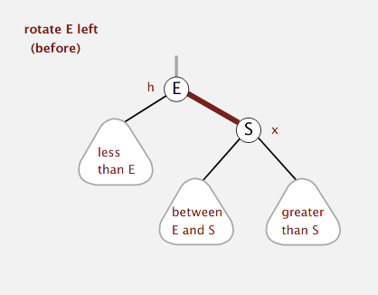
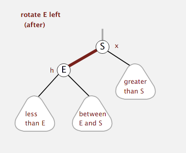

## Red-Black BST

representing the 2-3 tree as a BST, with "internal" left-leaning links as glue
for 3-nodes. a red-black BST, by definition, is a BST such that: 
    - No node has two red links connected
    - every path from root to null link has equal number of black links
    - red links always lean left.

The ``` get() ``` code is exactly the same as that of BST, doesn't matter if
links are red or not. Same for any searching functions (e.g. ``` floor() ``` and
``` ceiling() ```).

##### Implementation

Add a new field ``` boolean color ``` in ``` Node ```. can let RED be true and
BLACK be false. Then what are the helper functions necessary? They help to
maintain symmetric order and perfect black balance.




```
private Node rotateLeft(Node h) {
    assert isRed(h.right);
    Node x = h.right;
    h.right = x.left;       // between E and S
    x.left = h;             // let E be left node of S
    x.color = h.color;      // taking over h original color
    h.color = RED;          // E becomes a red linked node
    // attach to parent node, is root of newly rearranged subtree.
    return x; 
}
``` 

paradoxically  we also need a ```rotateRight``` helping us to reorientate.
we also need a color flipping ``` flipColors(Node h) ``` in case that there's a
Node with 2 red links, i.e. a temporary 4-Node. change both to black.
