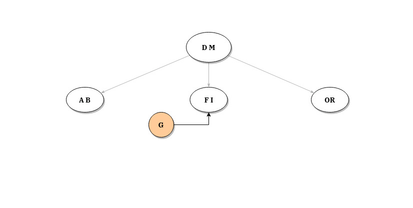

## 2-3 search trees 

**pros**: when elements added in any order, results in a balanced tree with even
height throughout. this allows for ``` get ```, ``` put ``` and ``` delete ``` to be done
in c lg n time.

**cons**: difficult to implement.

**concept**: possible to have 2-nodes and 3-nodes. see below for insertion into
3-node that percolates upwards. (idea is 2-nodes become 3-nodes first, then
temporary 4-nodes that bubble their middle element upwards and have their left
and right elements be 2-nodes on the left and right branches.)



BST
