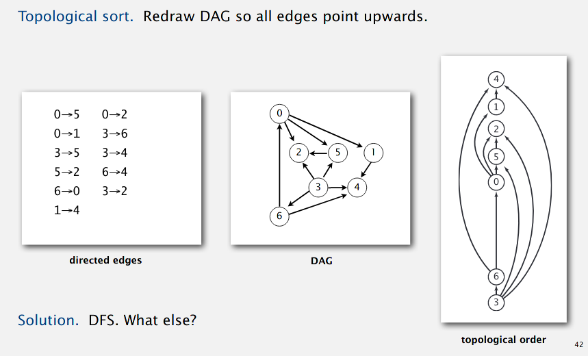
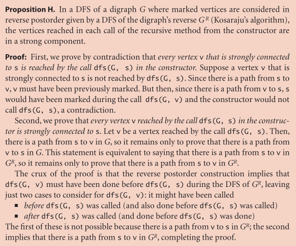

### Digraphs

Set of vertices connected pairwise by **directed** edges. Follow edges in given
direction is neccessary. *Indegree* and *outdegree* are new terms.

road networks, blog callbacks, logic boolean illustrations, logic circuits,
wordnet graphs...

#### Problems

1. **Path**. Is there a directed path from s to t?
2. **Shortest path**.
3. **Topological sort**. Can we draw a digraph so that all edges point upwards?
4. **Strong connectivity**. Is there a directed path between all pairs of
   vertices?
5. **Transitive closure**. For which vertices *v* and *w* is there a path from
   *v* to *w*?
6. PageRank.

#### API

key differences of ```Digraph``` from ```Graph```

- ```addEdge ``` now adds a directed edge v --> w
- ```adj ``` returns an ```Iterable<Integer>``` of vertices points **from** w.
- the only difference in implementation is we only have ```adj[v].add(w)``` but
  not ```adj[w].add(v)``` 

#### Search algorithm for paths in digraphs.

Find all vertices reachable from vertex *s* along directed path. We can use
precisely the same DFS code to achieve this.

Example of Digraph: Program control flow analysis.

- unreachable code
- infinite loop

Also, garbage collection? CALLED IT

- roots: objects directly accessible by program.
- reachable objects: indirectly accessible by program. not for collection.
- unreachable objects:

**Mark and sweep algorithm:**

- mark all reachable objects
- sweep (if object is unmarked, it is garbage.)

Same logic goes for why we can use the same BFS code as with undirected graphs.
BFS is useful for *computing shortest paths* from s to all other vertices in a
digraph in time O(E+V).

#### Topological Sort

e.g. Precedence scheduling. If we have a digraph that has every edge represent a
prerequisite relation, then pulling that out into a linear graph with all the
arrows pointing upwards requires a topological sort.

Note that this only works on *directed acyclic graphs* or DAGs.



Trick: To return vertices in postorder.

```java
public class DepthFirstOrder {
    private boolean[] marked;
    private Stack<Integer> reversePost[];

    public DepthFirstOrder(Digraph G) {
        reversePost = new Stack<Integer>();
        marked = new boolean[G.V()];
        for (int v = 0; v < G.V(); v++)
            if (!marked[v]) dfs(G, v);
    }

    private void dfs(Digraph F, int v) {
        marked[v] = true;
        for (int w : G.adj(v))
            if (!marked[w]) dfs(G, w);
        reversePost.push(v);
    }
    public Iterable<Integer> reversePost() {
        return reversePost;
    }
}
``` 

Directed Cycle detection tells us if a topological sort is possible.

#### Strong components

Vertices *v* and *w* are strongly connected if there is a directed path from *w*
to *v* and from *v* and *w*. "Is strongly connected" is an equivalence relation
(and thus a partition).

Every digraph has between 1 and V strongly connected components. there are no
cycles in a DAG, so every DAG has V strongly connected components.

linear time DFS algorithm (Tarjan) was found in 1972, in 1980 Kosaraju found
easy two-pass linear-time algorithm. Even easier linear-time algorithms were
found in 1990.

##### Kosaraju-Sharir algorithm

**Reverse graph**. Strong components in G are the same as in the graph with all
the edges reversed.

**Kernel DAG**. Each strong component can be condensed into one set of
"equivalent vertices". Between each of these strong components, we can do a
topological sort (as we have ignored all the cyclic parts).

1. Compute reverse postorder of reversed graph.
2. Run DFS (or BFS!) in original graph in the order of 1)'s reverse postorder.

Proof for correctness: tricky. See textbook.


