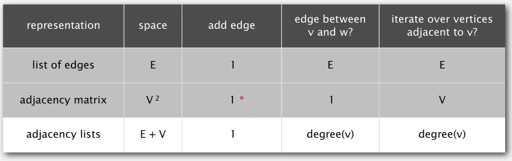

## Graphs

### Undirected graphs.

Set of *vertices* connected pairwise by *edges*.

#### Some terms and the challenges associated

1. **Path**. sequence of vertices connected by edges
2. **Cycle**. path that starts and ends with the same vertex.
3. **Euler tour**. cycle that passes through each edge exactly once.
4. **Hamiltonian tour**. cycle that passes through each vertex exactly once.
---
1. **Connectedness**. a path exists between two connected vertices.
2. **Biconnectivity**. is there a vertex that disconnects the graph when
   removed?
3. **Minimum spanning tree (MST)**. what's the least weighted path between two
   vertices?
4. **Shortest path search**. what's the shortest path between two vertices.
---
1. **Planarity**. does the graph have no crossing edges?
2. **Graph isomorphism**. do two adjacency-lists represent the same graph?

### Undirected graph API

a few possible representations:

- set-of-edges *(very inefficient)*
- adjacency-matrix *(most graphs are sparse, meaning most entries are 0, making
  the matrix representation very inefficient)*
- adjacency-list *(at each index a bag of the adjacent vertices are stored)*

### Trémaux maze exploration

Effective backtracking is key; if a vertex has been traversed before it should
not be traversed again. The key is to leave a record of vertices previously
traversed. So a strategy would be upon reaching vertex *v*,

- mark *v* as visited,
- recursively visit all unvisited nodes adjacent to *v*.
